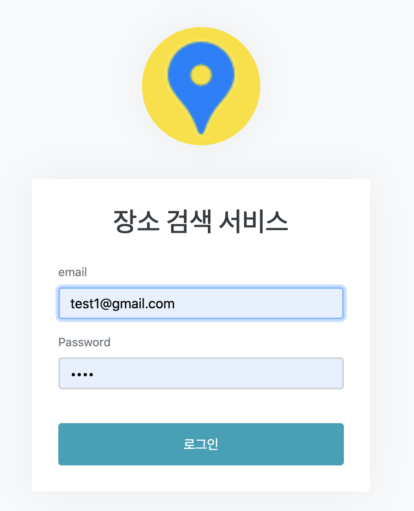

## Place Search Service

## Contents
* [Specifications](#chapter-1)
* [Requirement](#chapter-2)
* [Strategy](#chapter-3)
* [Domain](#chapter-4)
* [How to run](#chapter-5)
* [How to Test](#chapter-6)


### <a name="chapter-1"></a>Specifications 
````
 OpenJDK11
 Spring Boot 2.3.1.RELEASE
 Spring Security
 Spring Data JPA
 Spring Data Redis
 Embedded Redis 
 Thymeleaf 
 WebJars
````

### <a name="chapter-2"></a>Requirement 
````
오픈 API를 이용한 장소 검색 서비스
- 로그인 기능이 제공되어야 합니다.
- 키워드를 이용한 장소 검색이 가능해야 합니다.(open api 이용)
- 각 검색 결과의 상세정보(지번, 도로명주소, 전화번호 등)을 확인 할 수 있어야 합니다.
- 사용자가 많이 검색한 순서로 최대 10개의 검색 키워드를 제공 합니다.
````

### <a name="chapter-3"></a>Strategy 
````
Login : Spring Security
Client : Thymeleaf template engine + wabjars(jquery + bootstrap)
DB : embedded h2 db(user), embedded redis(top keyword)
````
### <a name="chapter-4"></a>Domain 
```
Member 
     id
     email
     password
     createdDate
     modifiedDate

TopSearchKeyword
      id
      topKeywords
```

### <a name="chapter-5"></a>How to Run
```
1. build
./gradlew build

2. run
./gradlew bootrun

3. test 
./gradlew test
```

### <a name="chapter-6"></a>How to Test

1. Spring Boot Application을 실행 합니다. 

2. http://localhost:8080 접속 후 미리 생성해 놓은 테스트 계정으로 로그인 합니다
   - test1@gmail.com / 1234 
   - test2@gmail.com / 1234
   - test3@gmail.com / 1234

 
3. 로그인 후 검색어를 입력하여 장소 검색을 합니다. 
   1) 인기 키워드와 조회수를 확인 할 수 있습 니다. ( 자동 롤링 적용)
   2) 인기 키워드를 클릭하면 해당 키워드로 바로 검색을 할 수 있습니다


4. 검색 결과를 클릭하여 상세 보기를 노출 합니다.


5. Daum 지도 바로 가기 버튼을 클릭하여 해당 지역의 지도를 확인 합니다
 
